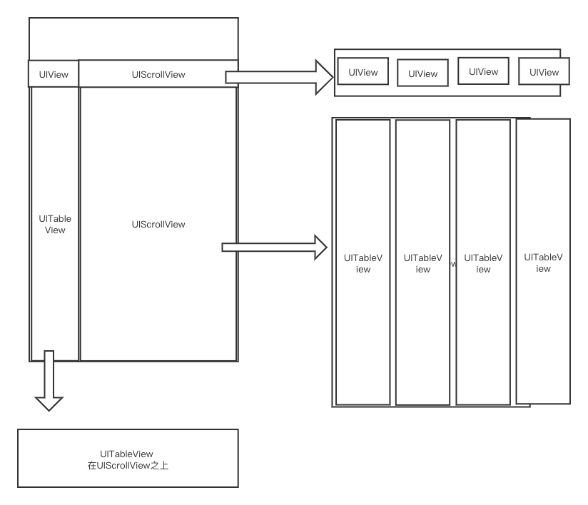

# GYMixtureScrollView
可 上下 左右滑动的 tableview

---

#### 说明
在项目中经常存在 既可以左右滑动（固定左边），又可以上下滑动（固定顶部）

#### 线上效果图


#### 设计图


#### 效果图


#### 核心代码
```
- (void)scrollViewDidScroll:(UIScrollView *)scrollView {
    if (scrollView == self.leftTableView) {
        for (UITableView *tableView in self.rightTableViewArr) {
            tableView.contentOffset = CGPointMake(0, scrollView.contentOffset.y);
        }
    } else if (scrollView == self.rightScrollView) {
        self.rightTopScrollView.contentOffset = CGPointMake(scrollView.contentOffset.x, 0);
    } else if (scrollView == self.rightTopScrollView) {
        self.rightScrollView.contentOffset = CGPointMake(scrollView.contentOffset.x, 0);
    } else {
        UITableView *tableView = (UITableView *)scrollView;
        self.leftTableView.contentOffset = CGPointMake(0, scrollView.contentOffset.y);
        for (UITableView *itemTableView in self.rightTableViewArr) {
            if (itemTableView != tableView) {
                itemTableView.contentOffset = CGPointMake(0, scrollView.contentOffset.y);
            }
        }
    }
}

```
---
左侧tableView 事件处理

```
- (BOOL)pointInside:(CGPoint)point withEvent:(UIEvent *)event {
    if (CGPathIsEmpty(self.path.CGPath)) {
        return YES;
    } else if (CGPathContainsPoint(self.path.CGPath, nil, point, nil)) {
        return YES;
    } else {
        return NO;
    }
}

```
